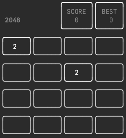

# Twenty forty-eight



## Description
This project is a simple implementation of the popular game 2048, written in Go. It utilizes the `bubbletea` library for the TUI (Text-based User Interface) and offers a classic 2048 gameplay experience where players combine tiles of the same value to try to reach 2048.

## Installation

```bash
go install github.com/SkYler163/twenty-forty-eight@latest
```

## Usage
After launching the game, you can control the tiles using the following keyboard keys:

- Arrow Keys: Move the tiles in the corresponding direction.
- Ctrl+C: Exit the game.
- Ctrl+R: Restart the game.
- Ctrl+E: Reset the high score and restart the game.

Enjoy playing and try to beat your high score!

## License
This project is licensed under the MIT License - see the [LICENSE](https://github.com/SkYler163/twenty-forty-eight/blob/master/LICENSE) file for details.

## Acknowledgments
Thanks to the Go community and the creators of the [bubbletea](https://github.com/charmbracelet/bubbletea) and [lipgloss](https://github.com/charmbracelet/lipgloss) libraries for providing the tools to build this game.